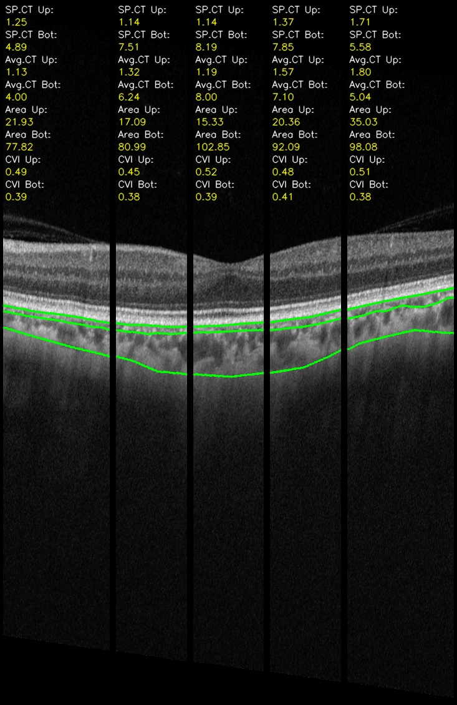
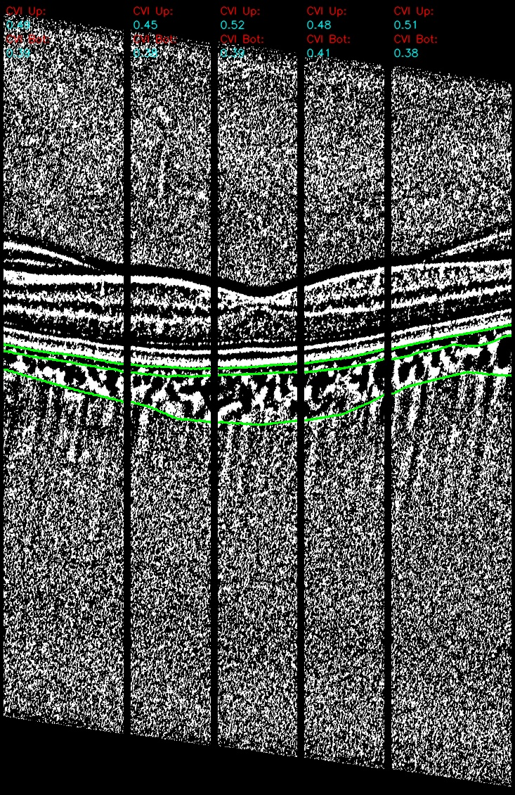

# Chordial Measurement

## Programme Explaination
### Inputs
Three lines and one dot to indicate different boundaries in the choroid:
- *Upper Yellow Line* --> RPE separating the retina and the choroid.
- *Middle Yellow Line* --> Boundary between the inner and outer choroidal layer.
- *Lower Yellow Line* --> Choroid-Scleral Interface.
- *Red dot* --> Denote the location of the mcular.

### Outputs:
Each image will be divided into 5 Parts:
1. Subfoveal (central 1mm centered at the macula)
2. Left Inner Sector (left side 500um to 1500um from the macula) 
2. Right Inner Sector (right side 500um to 1500um from the macula) 
3. Left Outer Sector (right side 1500um to 3000um from the macula)
3. Right Outer Sector (left side 1500um to 3000um from the macula)

For each part, we measure all of the following parameters:

1. Average Choroidal Thickness
    - Choroidal Thickness of the Inner Choroidal Layer
    - Choroidal Thickness of the Outer Choroidal Layer 
2. Choroidal Area 
    - Choroidal Area of the Inner Choroidal Layer
    - Choroidal Area of the Outer Choroidal Layer
3. Choroidal Vascular Index (CVI) (i.e. The proportion of Dark Zone over the total choroidal area)
    - CVI of the Inner Choroidal Layer
    - CVI of the Outer Choroidal Layer

## Requirements
1. Install [Anaconda](https://www.anaconda.com/distribution/) first
2. Then use:
```
$ pip install -r requirements.txt
```

## Run

### For single image analysis
- filename:
    - filename-0001.tif    -> Raw Picture
    - filename-0002.tif    -> Yellow lines for choroid positions
    - filename-0003.tif    -> Yellow dot for macular position
    - filename-NiBlack.tif -> NiBlack Binary image

Using the command below:
```bash
$ python index.py --img filename_A
```
For debugging purpose:
```bash
$ python index.py --img filename_A --logging_level DEBUG
```

#### Sample Run:
```bash
python index.py --img ./data/example_1
```
### For batch analysis
- **FOLDER**:
    - filename_A:
        - filename_A-0001.tif    -> Raw Picture
        - filename_A-0002.tif    -> Yellow lines for choroid positions
        - filename_A-0003.tif    -> Yellow dot for macular position
        - filename_A-NiBlack.tif -> NiBlack Binary image
    - filename_B:
        - filename_B-0001.tif    -> Raw Picture
        - filename_B-0002.tif    -> Yellow lines for choroid positions
        - filename_B-0003.tif    -> Yellow dot for macular position
        - filename_B-NiBlack.tif -> NiBlack Binary image
    ...

#### Analyse batch files:
```bash
python index.py --folder PATH_TO_FOLDER
```
#### Sample Run:
```bash
python index.py --folder ./data
```

## Command Flags:
| Flag            | Values             | Default  |
| --------------- |:------------------:| -----:|
| --img           | path to the image  | Nil |
| --folder        | path to the folder | Nil |
| --logging_level | INFO/DEBUG         | INFO |


## Results
This programme will generally generate two files for each image:
- *.csv* file. Contains all numeric results.
- Analyzed images. Records how the programme runs. Helps debug.
    - One for raw image.
    - One for binary image.

Resulting visualizations:
Raw Image Output         |  Binary Image Output
:-------------------------:|:-------------------------:
  |  
